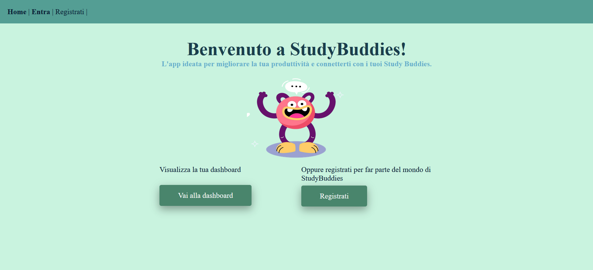
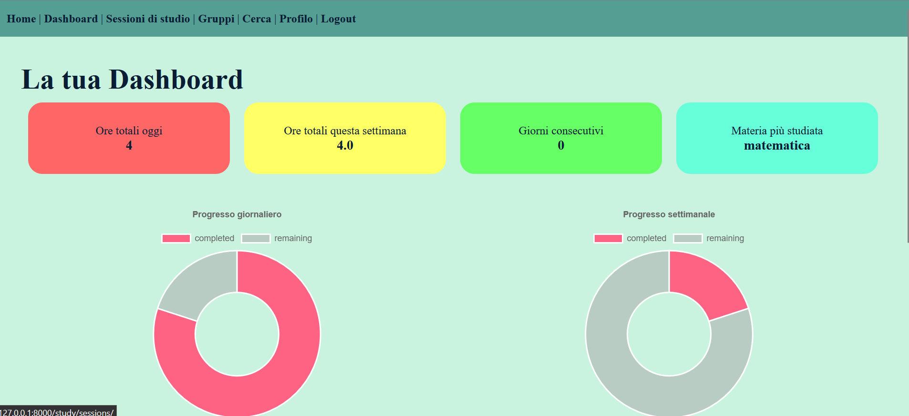
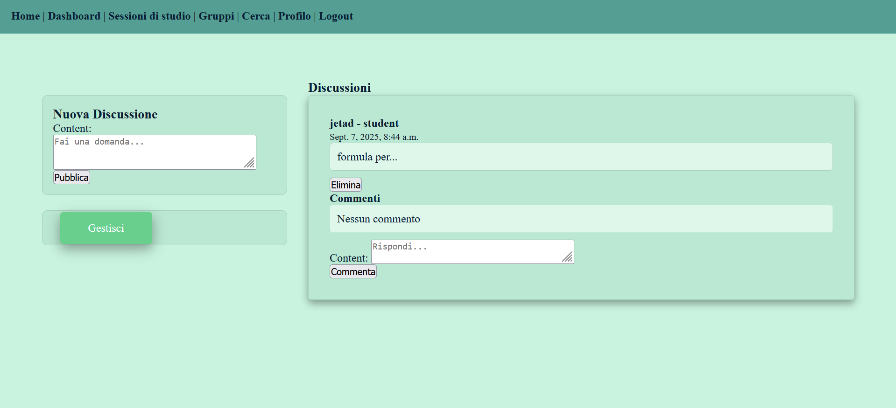
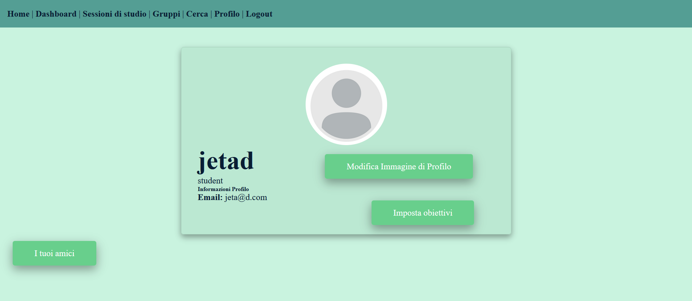
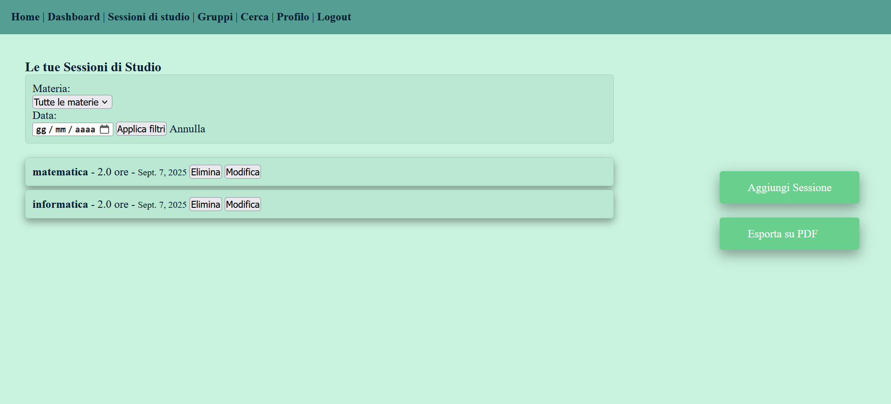

### **StudyBuddies - Un social media che non ti fa perdere tempo**
**StudyBuddies** è un'applicazione web ideata per studenti e professionisti che vogliono 
**monitorare** il proprio tempo di studio, analizzare statistiche attraverso grafici e impostare degli obiettivi per organizzare lo studio al meglio. 
Invece di distrarti, puoi connetterti con i tuoi amici (i tuoi StudyBuddies) e
con altre persone del settore di interesse per approfondire le tue conoscenze.

**Funzionalità**:
###  Monitoraggio 
- **Tracciamento delle sessioni di studio** con nome della materia, durata e data
- **Dashboard personale** con riepilogo ore (giornaliero, settimanale)
- **Materia più studiata** 

###  Visualizzazione Dati
- **Grafico a torta** distribuzione tempo per materie in una giornata
- **Grafico a linee** trend settimanale delle ore di studio
- Si possono impostare **obiettivi** 
- Secondo gli obiettivi, si calcola lo **streak**, ovvero il numero di giorni consecutivi in cui si è raggiunto l'obiettivo

### Social Productivity
- **Sistema di amicizie** con richieste e accettazione
- **Immagine di profilo** per renderti più riconoscibile dagli amici
- **Ricerca utenti** per username
- **Condivisione progressi** (solo ore totali, niente distrazioni)

### Gruppi di Studio
- **Gruppi pubblici e privati** con discussioni
- **Gestione membri** (inviti, rimozioni)

###  Export e Report
- **Generazione PDF** dei propri dati
- **Selezione materie** per report personalizzati
- **Dettagli completi** delle sessioni di studio
## Screenshot

*Dashboard principale con statistiche e riepilogo ore*

*Dashboard principale con statistiche e riepilogo ore*

*Gestione gruppi e discussioni con commenti in tempo reale*

*Pagina profilo con grafici e obiettivi*

*Grafici dettagliati delle sessioni di studio*

