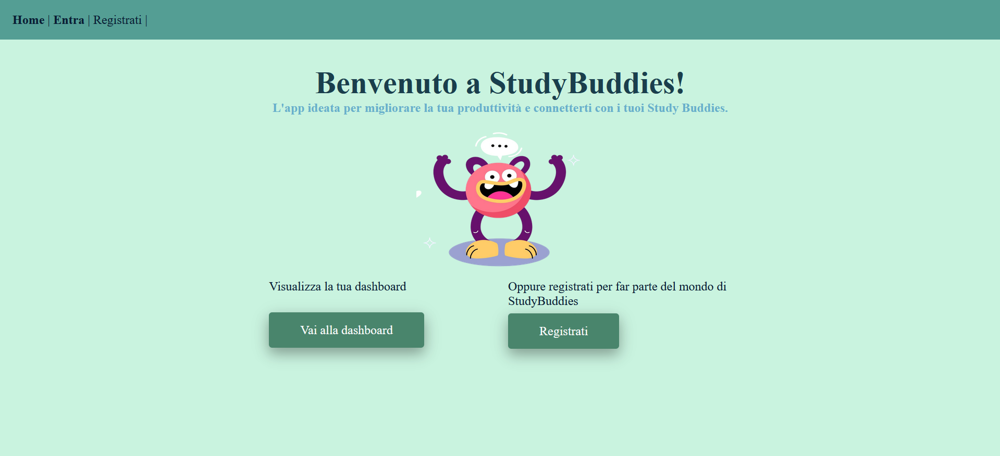

### **StudyBuddies - Un social media che non ti fa perdere tempo**
**StudyBuddies** è un'applicazione web ideata per studenti e professionisti che vogliono 
**monitorare** il proprio tempo di studio, analizzare statistiche attraverso grafici e impostare degli obiettivi per organizzare lo studio al meglio. 
Invece di distrarti, puoi connetterti con i tuoi amici (i tuoi StudyBuddies) e
con altre persone del settore di interesse per approfondire le tue conoscenze.

**Funzionalità**:
###  Monitoraggio 
- **Tracciamento delle sessioni di studio** con nome della materia, durata e data
- **Dashboard personale** con riepilogo ore (giornaliero, settimanale)
- **Materia più studiata** 

###  Visualizzazione Dati
- **Grafico a torta** distribuzione tempo per materie in una giornata
- **Grafico a linee** trend settimanale delle ore di studio
- Si possono impostare **obiettivi** 
- Secondo gli obiettivi, si calcola lo **streak**, ovvero il numero di giorni consecutivi in cui si è raggiunto l'obiettivo

### Connettiti con i tuoi StudyBuddies
- **Sistema di amicizie** con richieste e accettazione
- **Immagine di profilo** per renderti più riconoscibile dagli amici
- **Ricerca utenti** per username
- **Condivisione progressi** (solo ore totali, niente distrazioni)

### Gruppi di Studio
- **Gruppi pubblici e privati** con discussioni - ricerca abilitata anche per gruppi pubblici
- **Gestione membri** (inviti, rimozioni) - nel caso di gruppi privati dove il creatore del gruppo ha il ruolo di moderatore

###  Export e Report
- **Generazione PDF** dei propri dati su file PDF
- **Selezione materie** per report personalizzati
## Screenshot

*La pagina principale che vede un utente non autenticato*

*Dashboard principale con riepilogo ore e grafici per monitorare i progressi*

*Gestione gruppi (privati o pubblici) e discussioni con commenti*

*Pagina profilo dove è possibile caricare un'immagine e visualizzare la lista di amici*

*Lista delle sessioni di studio registrate con l'opzione di filtraggio e di esportazione su PDF*

